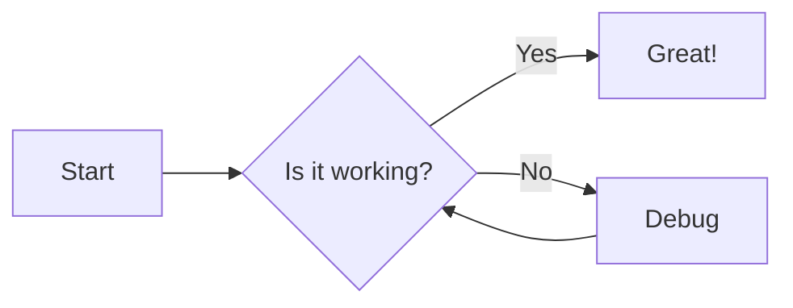
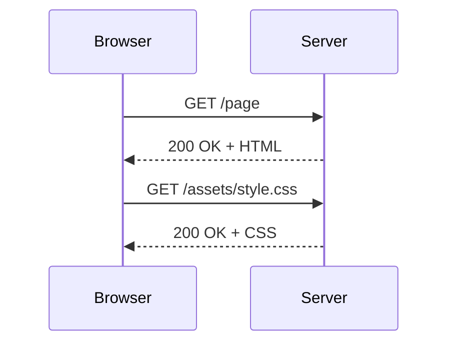
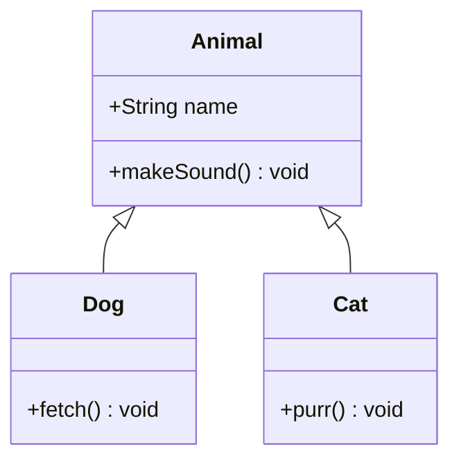
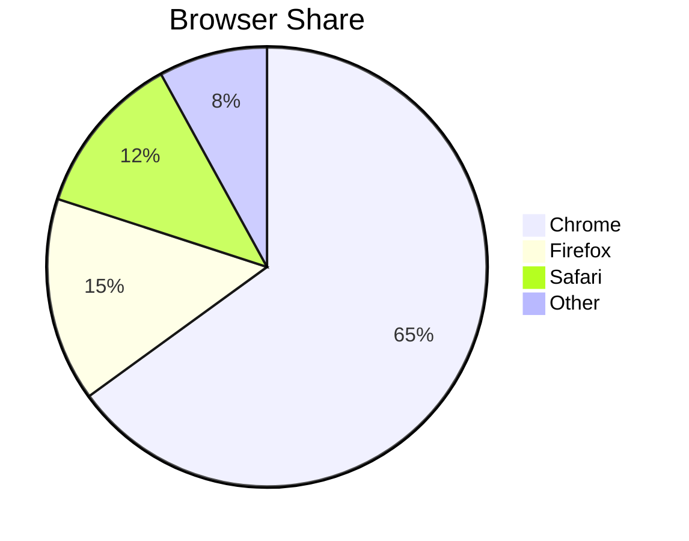

# Mermaid Diagrams

Enable [Mermaid](https://mermaid.js.org/) diagram rendering on any page by adding `mermaid: true` to the front matter:

```yaml
---
layout: default
title: My Page
mermaid: true
---
```

Mermaid is loaded **only on pages that opt in**. Write diagrams using standard fenced code blocks with the `mermaid` language identifier.

## Flowchart

````markdown

````

**Rendered:**


## Sequence diagram

````markdown

````

**Rendered:**


## Class diagram



## Pie chart


